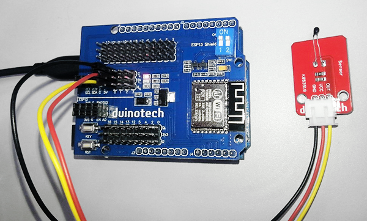
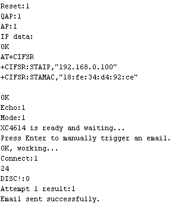
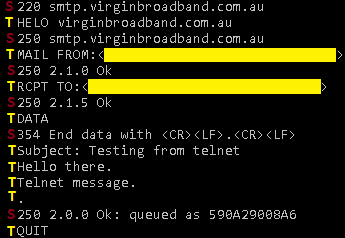
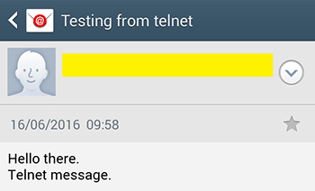

# WIFI Email Notifier

<deprecated />

**Note:** This project is now deprecated and is not supported. For email alerts, a simpler project would be to use IFTTT as shown in the [Intruder-Alert](https://jaycar.com.au/intruder-alert) project, or if you require more datalogging, try the [Motherload-datalogger](https://jaycar.com.au/motherload-datalogger) project. This project is now archived and not supported.

This project was inspired by one of my colleagues who wanted to be notified if his server room got too hot, but you could easily change the trigger to some other form of input, or even to simply report some data back to you at a regular rate.

The first thing you'll need to check is whether this project will work with your WIFI network and email address. Most email servers are fussy about who they will accept email from, but if your email address is provided by your ISP, it will generally accept email from connections coming in through that ISP. For example, I have Virgin Mobile Broadband, and the virginbroadband.com.au email server is happy to receive emails while I'm connected to Virgin Mobile Broadband. If you aren't sure, you can even check this with a computer before buying the components. Check out the How It Works section below.

## Shopping List:

| Qty | Code                                    | Description               |
| --- | --------------------------------------- | ------------------------- |
| 1   | [XC4430](http://jaycar.com.au/p/XC4430) | Leonardo Board            |
| 1   | [XC4614](http://jaycar.com.au/p/XC4614) | WiFi Shield               |
| 1   | [XC4494](http://jaycar.com.au/p/XC4494) | Analog Temperature Sensor |

Of course, if you want to sense something different, you can use a different sensor module. For example, to have your Arduino email you when it's raining, use a [XC4603 Rain Sensor Module](https://jaycar.com.au/p/XC4603) .

## Connections:

This is another easy to build project- the WIFI Shield plugs into the top of the Leonardo, and the Temperature Sensor Module plugs into the A0 headers on the Shield.



The important connections are listed below:

| Leonardo | WIFI Shield | Temp Sensor | Function                     |
| -------- | ----------- | ----------- | ---------------------------- |
| 5V       | 5V          | VCC         | Power                        |
| GND      | GND         | GND         | Ground                       |
| D0(RX)   | TX          |             | Data from Shield to Leonardo |
| D1(TX)   | RX          |             | Data from Leonardo to Shield |
| A0       |             | OUT         | Analog temperature signal    |

You should also ensure that the two small slide switches on the shield are set to the 'ON' position.

## Sketch uploading:

There aren't any special libraries that need to installed, just open the sketch file, change the WIFI and email settings as detailed in the 'How It Works' section below. Then select the Leonardo board and correct serial port and upload. Open the serial monitor and select 'Both NL & CR' for line ending and 115200 baud rate. If everything is working, you should get something similar to the following:



If you press enter, it will manually trigger an email transmission.


If the email is triggered immediately and the air temperature is not above 35 degrees, check the sensor value (24 in the above picture). You may have wire the temperature sensor wrong, or there is a fault with it. You can also check the temperature sensor response by warming it in your hand. The software is set by default to only send an automatic email every 15 minutes.

## How It Works:

The WIFI shield is an impressive piece of gear for its size- all the smarts are hidden under the metal shield in one corner of the board. Still, we have to do a bit of work to get it to send emails. After the initialisation code which makes sure that the shield is connected to a WIFI network, the code does the following when triggered:

1. Connect to the email server (smtp server name) on port 25
   - The server sends back a `220` response in greeting.
2. Send `HELO email_server_name` to server.
   - The server sends back a `250` response if no error was found.
3. Send `MAIL FROM :sender_email_address` to server.
   - The server sends back a `250` response if no error was found.
4. Send `RCPT TO:recipient_email_address` to server.
   - The server sends back a `250` response if no error was found.
5. Send `DATA` to server.
   - The server sends back a `354` response if it is ready to receive data.
6. The body of the email, including subject line as `Subject:subject` is sent to the server
7. The end of the data is indicated by a `<CR><LF>.<CR><LF>` sequence.
   - The server sends back a `250` response if no error was found.
8. Send `QUIT` to server.
   - Server sends back `221` code and closes the connection.

Note that some items will depend on your ISP/email address, and the subject and email body will depend on what you want to communicate.

For my `virginbroadband.com.au` email address, the smtp server is `smtp.virginbroadband.com.au`, while the email server name in the HELO command is just `virginbroadband.com.au` (just what's to the right of the @ in the email address). Your ISP should have information on this- look for "outgoing mail server name".

The [Wikipedia page on the SMTP protocol](https://en.wikipedia.org/wiki/Simple_Mail_Transfer_Protocol) also contains an example of such the process in action. You can emulate this process with a telnet program if you want to check that it works before buying the parts.

On Windows 7 and Windows 10, the telnet program is not enabled by default, but can be enabled by selecting Control Panel>Programs>Programs and Features, click on 'Turn Windows features on or off", then ensure 'Telnet Client' is selected and press OK.

To run telnet, open a Command Prompt and type: telnet

```plaintext
servername 25
```

If port 25 doesn't work, try 587. The following shows a sample session (with email addresses blanked):



The T lines are typed into telnet (and followed by the 'enter' key), while the S lines are the server responses. If you make an error while typing, you may not be able to use backspace to change it, as the keystrokes are sent to the server as soon as they are typed. You can usually try again, or try closing and reopening the connection if that doesn't work.

Here's what it looks like when I receive the email from the above telnet session:



If you see a '571' error code, then your connection is probably being blocked to avoid spam, and you probably won't be able to use that ISP/email address combination with the Arduino project. If you can't otherwise get telnet to send an email, then you probably won't have working settings you can use.

To change the sketch to suit your settings, you need to change the following lines at the start to suit the settings that worked for you in telnet:

```cpp
#define SSIDNAME "********"
#define SSIDPWD "********"
#define HOSTNAME "smtp.virginbroadband.com.au"
#define SERVERNAME "virginbroadband.com.au"
#define HOSTPORT "25"
#define RCPTEMAIL "*****@virginbroadband.com.au"
#define SUBJECTLINE "Subject: Temperature Alert from Arduino"
```

Of course, you'll need to make sure the WIFI name (SSID) and password are set to match your ISP too. The sketch provides some diagnostic information to the serial port monitor, so you can see that everything works, and if not, where it fails. You can also manually trigger an email send by pressing the 'enter' key in the serial monitor.

The first thing you would want to do after personalising to suit your WIFI and email settings is to personalise the message that is sent. Anything that is sent with the `WIFIsend()` command between the subject line and `\r\n` becomes the body of the text. Unlike the `Serial.print()` commands, the `WIFIsend()` command does not automatically translate numbers into strings, so you have to use the `itoa()` function to put the string equivalent of the number in the `num[]` character array.

## Improvements:

There's no reason you can't report multiple values- to output multiple analog inputs, you could use something like:

```cpp
ltoa(analogRead(A0),num,10);    // convert number to string
WIFIsend("\rAnalog 0 is:");      //explanation
WIFIsend(num);      //value
ltoa(analogRead(A1),num,10);    // convert number to string
WIFIsend("\rAnalog 1 is:");      //explanation
WIFIsend(num);      //value      //value
```

If you need to change the minimum time between automatic emails, then the value RPTDELAY sets this in milliseconds (900000 by default, which is 15 minutes or 900 seconds). The UL after the number means it is an unsigned long number, which can hold a value up to approximately 50 days.

If the line:

```cpp
if((coretemp>35)&&(rpttimeout+RPTDELAY<millis())){
```

is changed to:

```cpp
if((rpttimeout+RPTDELAY<millis())){
```

Then the email will be sent unconditionally every 15 minutes (or whatever period you choose). This could be an easy way to do datalogging from a remote location.

The line:

```cpp
for(int i=0;i<3;i++){     //maximum of three attempts
```

in the `doemail()` function determines the maximum number of times the sketch attempts to send the email. If you have an intermittent WIFI connection, you could increase the 3 value to increase the chances of a message getting through.

And of course if you don't want to know the temperature, you could use a different sensor.
